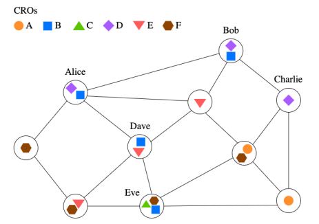
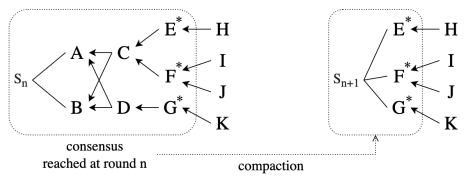

# What are CROs?

**CROs** are composable programmable objects that can be updated in real time concurrently and subscribed to as **PubSub** groups on a open P2P network.

### *Blueprint*

A CRO is an instance of a ***blueprint*** that specifies the operations for each CRO. It can be created using built-in CRDTs presented in the protocol or by composing other existing ***blueprints***.

### Signaling

***Signaling*** is a CRO-level term to designate the way CROs interact with each other. A **signal** is originated from an operations at the sender CRO which is then tranformed into an operation at the receiver CRO.

A node that wants to send a cross-object signal needs to have the hash graphs of both the sender and receiver CROs locally. This is crucial for causality to work, where the signal needs to specify its causal dependencies in both sender and receiver CROs hash graphs.

### Interaction

Nodes interact with a given CRO through ***verbs***, which are a set of methods definded by the Topology Protocol. CROs are identified as **PubSub** groups where nodes only subscribe and publish on CROs they are interested in and all the nodes are connected peer-to-peer, as shown above.

  
   
  **Figure 1:** Alice, Bob and Charlie are subscribed to CRO D, receiving all updates performed on that CRO.  

There is a set of core methods for CROs: 

1. **CREATE:** creates a new CRO as well as a new PubSub group.
2. **UPDATE:** perform an update (publish) on a given CRO.
3. **SUBSCRIBE:** subscribe to receive the updates performed on a given CRO.
4. **UNSUBSCRIBE:** unsubscribe and stop receiving updates on a given CRO.
5. **SYNC:** reconcile the operations histories on a given CRO between the local one and the remote one.

### Operation life cycle

When a node performs an update by generating an operation on a CRO, the operation is added to the node's local copy of the CRO hash graph. So, if a node performs a write and right after a read, the read is guaranteed to observe the right. With this, CROs provide **high availability** and **low latency**.

### Snapshot

A **CRO snapshot** is a single hash graph that represents an agreement among the CRO’s replicas. These can be used as "state saves" to be persistent somewhere and to generate irreversible transactions on blockchains.

However, there are several problems regarding the computation of snapshots like unanimity, concurrency and bandwidth consumption.

Topology's solution builds on the **threshold logical clock (TLC)**. Each CRO has its own TLC operated by its subscriber nodes. When a node is ready to advance the TLC tick, it proposes the hashed frontier F∗ of its own hash graph by broadcasting it to other subscribers. To take a snapshot, a consensus round needs to be formed with three consecutive ticks. The process runs continuously, allowing snapshots to be taken periodically.

### Compaction

Grow-only hash graphs are a problem because they take an infinite amount of memory and are very inefficient. So, we need to use **compaction** to discard causal information from vertices that will never be causal dependencies again.

To know if a vertice is safe to drop, a node needs to receive a vertex from every other node that causally depends on the vertice. Our solution consists on using the **TLC** consensus rounds to promote compaction. Each round produces a hash graph with a frontier F that contains the stable vertices, compacting the previous vertices. The figure above shows the process.

  
   
  **Figure 2:** Compaction example.  

However, this compaction is unsafe because it may drop causal information in the hash graph that is needed to recongnize the causality of operations that haven't yet arrived from the network. With this, operations that come from unrecognizable causality may come from Byzantine nodes.